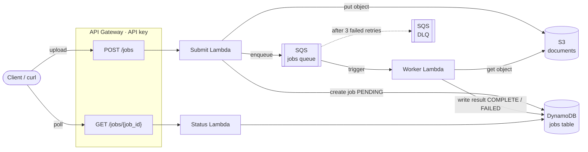

# Serverless Document Processing Pipeline

[](https://github.com/hishamissa/serverless-document-pipeline/actions/workflows/ci.yml)

An event-driven, serverless pipeline on AWS that accepts a document (CSV or
plain text), processes it asynchronously, and exposes the extracted results
through a status API. Built with AWS SAM, Python 3.12, and Lambda.

It is intentionally small but production-shaped: a queue decouples ingestion
from processing, duplicate deliveries are handled idempotently, malformed input
fails gracefully, poison messages land in a Dead Letter Queue, and every log
line is structured JSON correlated by job id.

---

## Architecture



**Flow**

1. Client `POST`s a document to `/jobs`. The **Submit Lambda** writes it to S3,
   creates a `PENDING` job row in DynamoDB, enqueues a message to SQS, and
   returns `202 Accepted` with a `job_id` — immediately, without waiting for
   processing.
2. The **Worker Lambda** is triggered by the SQS queue. It fetches the document
   from S3, extracts structured data, and writes the result to DynamoDB
   (`COMPLETE`), or marks the job `FAILED` with a reason if the document is
   malformed.
3. The client polls `GET /jobs/{job_id}` (the **Status Lambda**) to retrieve
   status and results.
4. A message that fails processing 3 times is moved to a **Dead Letter Queue**
   for inspection; a CloudWatch alarm fires when the DLQ is non-empty.

---

## The problem, and why event-driven / queue-based

Document processing is **slow and bursty**. Parsing can take seconds, and
uploads arrive in unpredictable spikes. If the API parsed documents inline, the
client would block on every request, a burst would overwhelm compute, and a
single bad file could fail the whole request.

Putting a **queue between ingestion and processing** solves this:

- **Fast responses** — the API just stores, enqueues, and returns `202`. The
  caller gets a `job_id` in milliseconds and polls for the result.
- **Load levelling** — SQS absorbs bursts. The worker scales out to drain the
  backlog and back down to zero when idle; nothing is over-provisioned.
- **Resilience** — if the worker errors or is briefly unavailable, messages stay
  on the queue and are retried. Nothing is lost. Repeated failures are isolated
  in the DLQ instead of blocking healthy traffic.
- **Independent scaling & evolution** — ingestion and processing scale on
  different signals and can change independently (e.g. swap the extractor)
  without touching the API.

---

## API

All endpoints require an API key in the `x-api-key` header.

### `POST /jobs`

Upload a document. The **raw document is the request body**.

| Query param | Values          | Default | Notes                     |
|-------------|-----------------|---------|---------------------------|
| `type`      | `csv` \| `text` | `text`  | How to parse the document |
| `filename`  | any string      | derived | Stored for reference      |

Returns `202` with `{ "job_id": "...", "status": "PENDING" }`.
Max body size 5 MB.

### `GET /jobs/{job_id}`

Returns the job status and, when finished, the extracted `result` (on
`COMPLETE`) or an `error` reason (on `FAILED`). `404` if the id is unknown.

**Status lifecycle:** `PENDING → PROCESSING → COMPLETE` (or `→ FAILED`).

---

## Example usage

Grab the API URL and key from the deployed stack (see [Deploy](#deploy)):

```bash
API_URL="https://<api-id>.execute-api.us-east-1.amazonaws.com/prod"
KEY=$(aws apigateway get-api-key --api-key <api-key-id> \
  --include-value --query value --output text)
```

### CSV

```bash
printf 'name,age,score\nalice,30,9.5\nbob,25,7.0\ncarol,41,8.2\n' > sample.csv

curl -s -X POST "$API_URL/jobs?type=csv&filename=sample.csv" \
  -H "x-api-key: $KEY" -H "Content-Type: text/csv" \
  --data-binary @sample.csv
# {"job_id": "a1ea54ad-a004-4ad9-bfd1-639b28a839a4", "status": "PENDING"}

curl -s "$API_URL/jobs/a1ea54ad-a004-4ad9-bfd1-639b28a839a4" -H "x-api-key: $KEY"
```
```json
{
  "job_id": "a1ea54ad-a004-4ad9-bfd1-639b28a839a4",
  "status": "COMPLETE",
  "filename": "sample.csv",
  "result": {
    "kind": "csv",
    "row_count": 3,
    "column_count": 3,
    "columns": ["name", "age", "score"],
    "numeric_stats": {
      "age":   {"count": 3, "min": 25, "max": 41, "mean": 32},
      "score": {"count": 3, "min": 7,  "max": 9.5, "mean": 8.2333}
    }
  }
}
```

### Plain text

```bash
printf 'cloud computing is great. cloud systems scale. serverless serverless serverless.' \
  | curl -s -X POST "$API_URL/jobs?type=text&filename=notes.txt" \
      -H "x-api-key: $KEY" -H "Content-Type: text/plain" --data-binary @-
```
```json
{
  "status": "COMPLETE",
  "result": {
    "kind": "text",
    "line_count": 1,
    "word_count": 10,
    "char_count": 80,
    "top_keywords": [
      {"word": "serverless", "count": 3},
      {"word": "cloud", "count": 2},
      {"word": "computing", "count": 1}
    ]
  }
}
```

A malformed document (e.g. an empty CSV) returns `status: FAILED` with an
`error` explaining why — it does **not** poison the queue.

---

## Deploy

**Prerequisites:** AWS CLI configured with credentials, AWS SAM CLI, Python 3.12.

```bash
sam build
sam deploy      # first run: --guided, or use the committed samconfig.toml
```

The stack outputs the API base URL, the API key id, and the resource names:

```bash
aws cloudformation describe-stacks --stack-name doc-pipeline \
  --query 'Stacks[0].Outputs' --output table
```

Everything is created in `us-east-1` and stays within the AWS free tier
(on-demand DynamoDB, arm64 Lambdas, no provisioned concurrency, no NAT).

---

## Tests

The suite unit-tests the extraction logic and exercises every handler against
**mocked AWS** (moto) — no cloud resources or credentials required.

```bash
python -m venv .venv && source .venv/bin/activate
pip install -r requirements-dev.txt
pytest -v          # 28 tests
ruff check .
```

Or fully reproducibly in Docker:

```bash
docker build -t doc-pipeline-tests .
docker run --rm doc-pipeline-tests
```

CI (`.github/workflows/ci.yml`) runs lint + tests and validates the SAM
template on every push and pull request.

---

## Teardown

```bash
./scripts/teardown.sh          # empties the S3 bucket, then deletes the stack
```

Removes all Lambdas, API Gateway, SQS queues, the DynamoDB table, IAM roles,
and the CloudWatch alarm.

---

## Design decisions & tradeoffs

### Why a queue instead of direct invocation?
The API could invoke the worker synchronously (or async `Event` invocation),
but a queue buys **load levelling, retries, and backpressure** for free. SQS
absorbs bursts and lets the worker scale independently, retries transient
failures without client involvement, and isolates repeatedly-failing messages
in a DLQ. Direct invocation couples the caller's latency to processing time and
has no natural buffer or retry story. The cost is eventual consistency — the
result isn't ready the instant `POST` returns — which is why the API is
poll-based (`202` + `job_id`).

### How idempotency is handled
SQS is **at-least-once**, so the worker must tolerate duplicate deliveries. Two
layers guard against double-processing:
1. A cheap **read guard** — if the job is already `COMPLETE`, the worker logs and
   skips.
2. The authoritative defence is a **conditional write**: completion only
   succeeds when the job is not already `COMPLETE`
   (`ConditionExpression: status <> COMPLETE`). A duplicate that races past the
   read guard fails the condition and is treated as a no-op. This was verified
   live — two duplicate deliveries left the row's `updated_at` untouched.

Because extraction is deterministic and the write is conditional, reprocessing
is safe and never corrupts a finished job.

### Why a DLQ?
Without a DLQ, a message that always fails (a bug, or a permanently unreadable
object) would be retried forever, wasting invocations and blocking the queue.
The DLQ (`maxReceiveCount: 3`) **quarantines poison messages** after three
attempts so healthy traffic keeps flowing, and preserves the failed message for
debugging. A CloudWatch alarm signals when anything lands there. Note the
distinction: *malformed documents* are an expected outcome and are marked
`FAILED` in DynamoDB (the message is consumed successfully) — only *unexpected*
failures (e.g. S3 unavailable, a bug) flow to the DLQ.

### Least-privilege IAM
Each function gets only the permissions it needs, via scoped SAM policy
templates: Submit can write S3 / write DynamoDB / send SQS; Worker can read S3 /
CRUD its DynamoDB table; Status can only read DynamoDB. No wildcard resource
policies.

### What would change to make this production-grade?
- **Auth**: replace the API key with Cognito / OAuth / IAM SigV4; add per-tenant
  authorization.
- **Result delivery**: offer webhooks or WebSocket/SSE push instead of polling.
- **Observability**: emit metrics (jobs processed, failure rate, latency),
  wire the DLQ alarm to SNS/PagerDuty, and add distributed tracing spans.
- **DLQ handling**: an automated redrive path and alerting runbook.
- **Schema & validation**: stronger input validation, size/type limits enforced
  at the edge, and a versioned result schema.
- **Data lifecycle**: TTL on DynamoDB job rows; tighter S3 lifecycle; encryption
  with a customer-managed KMS key.
- **Delivery**: staged environments (dev/stage/prod), automated deploys from CI,
  and canary releases.
- **Scale**: tune worker batch size / concurrency, add SQS long-polling and a
  reserved-concurrency cap to protect downstream systems.

---

## Repository layout

```
src/
  api/        submit + status Lambda handlers
  worker/     SQS worker handler + deterministic extraction logic
  common/     structured logging, DynamoDB job store (idempotent writes)
tests/        pytest suite (moto-mocked AWS)
template.yaml SAM infrastructure-as-code
scripts/      teardown script
```
